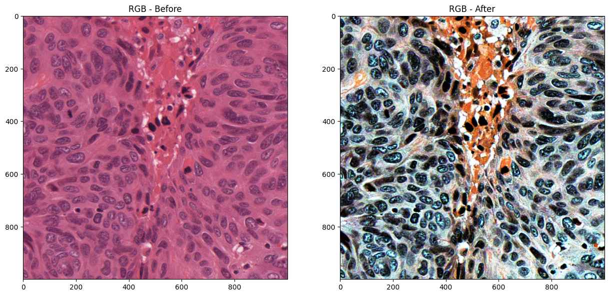
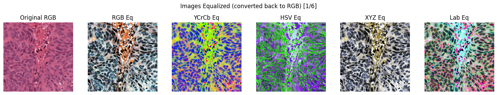
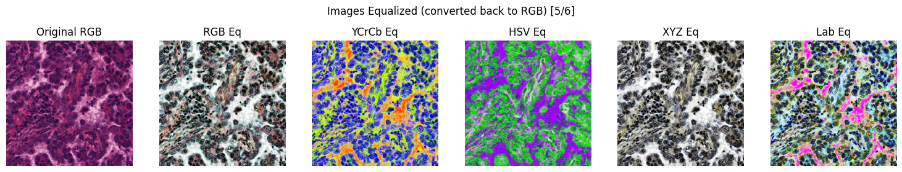
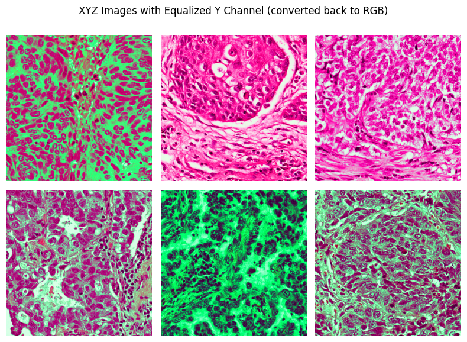
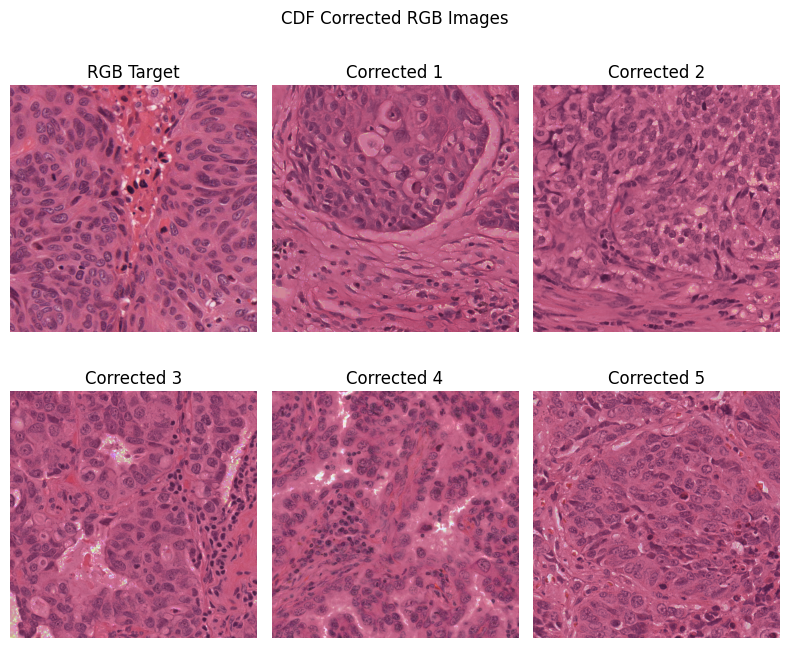
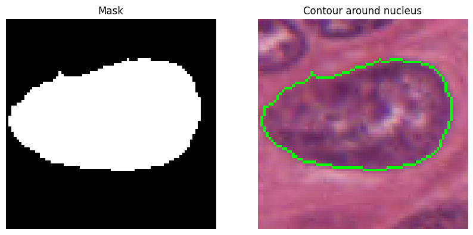
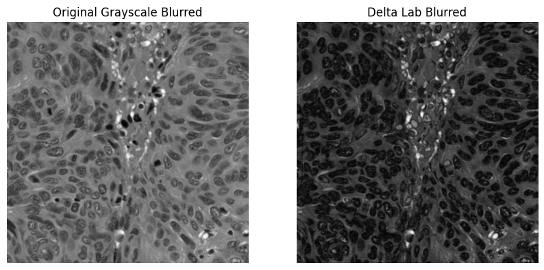

# Assignment 2

Viktor Modroczký\
Computer Vision @ FIIT STU

The [`utils.py`](utils.py) file contains functions that are used throughout the experiment notebooks. Each function is documented with a docstring that explains its purpose and usage.

## Experiment 1 - Image Correction

The experiment code and visualizations can be found in the [`experiment_1.ipynb`](experiment_1.ipynb) notebook.

### Histograms of the First Image in the Dataset

Column 1 | Column 2
:---: | :---:
 | 
 | 
 | 

### Histogram Equalization

Ranges of color spaces in OpenCV for 8-bit images ([source](https://docs.opencv.org/4.9.0/de/d25/imgproc_color_conversions.html)):

- Grayscale: [0, 255]
- RGB: [0, 255] for each channel
- YCrCb: [0, 255] for each channel
- HSV: [0, 180] for the H channel and [0, 255] for S and V channels
- XYZ: [0, 255] for each channel
- Lab: [0, 255] for each channel

These ranges need to be taken into consideration when performing histogram equalization. To perform histogram equalization on an image, each channel needs to be equalized separately. To equalize a channel, we use the `equalize_hist` function from the `utils.py` file. To correct the gamma of an image, we use the `gamma_correction` function from the `utils.py` file. Both functions are based on OpenCV tutorials ([for histogram equalization](https://docs.opencv.org/4.9.0/d4/d1b/tutorial_histogram_equalization.html) and [for gamma correction](https://docs.opencv.org/4.9.0/d3/dc1/tutorial_basic_linear_transform.html)).

The `correct_images` function in the `utils.py` file is used to apply histogram equalization to an array of images. We use this function on each image in each color space (except for the grayscale color space, where we only apply histogram equalization to one image).

#### Grayscale

A grayscale image only has a single channel, so both histogram equalization is only applied to one channel. We ran the following code to equalize the histogram of only one grayscale image:

```python
img_equalized = equalize_hist(img, 256)
```

**Results:**

The following images show the original grayscale image and the equalized grayscale image.


The following histograms show histograms of the original grayscale image and the equalized grayscale image.


#### RGB

An RGB image has three channels, so histogram equalization is applied to each channel separately. To equalize histograms of each RGB image, we ran the following code:

```python
rgb_images_eq = correct_images(rgb_images, [255, 255, 255])
```

**Comparison of one of the original RGB images with its equalized version:**



**Comparison of histograms of one of the original RGB images with its equalized version:**


**Every equalized RGB image:**


**Every original RGB image:**


#### YCrCb, HSV, XYZ and Lab

The same process as for the RGB color space was applied to the YCrCb, HSV, XYZ, and Lab color spaces. The only difference is that the H channel of the HSV color space has a range of [0, 180], so we used 180 as the maximum value for the equalization and gamma correction of the H channel.

The following code was used to equalize histograms and correct the gamma of each image in the YCrCb, HSV, XYZ, and Lab color spaces:

```python
ycrcb_images_eq = correct_images(ycrcb_images, [255, 255, 255])
hsv_images_eq = correct_images(hsv_images, [180, 255, 255])
xyz_images_eq = correct_images(xyz_images, [255, 255, 255])
lab_images_eq = correct_images(lab_images, [255, 255, 255])
```

These were then converted back to the RGB color space and then we visualized the results for each images from each color space:







However, it is better to only equalize the brightness channels of color spaces that have such a channel. From YCrCb it is the Y channel, from HSV it is the V channel, from XYZ it is the Y channel, and from Lab it is the L channel. The following are the results of equalizing only the brightness channels of the images:





The best results were achieved by equalizing L channel in the Lab color space and the Y channel in the YCrCb color space. Equalizing the V channel in the HSV color space produced images that were not uniform in brightness. Equalizing the Y channel in the XYZ color space did not produce good results.

### Gamma Correction on RGB Images

We tried to correct the gamma of one of the original RGB images and then visualize the results. We used 5 different gamma values: 0.5, 0.8, 1.2, 1.8, and 2.5.


We can see that values less than 1 make the image overall brighter, and values greater than 1 make the image overall darker.

### Source to Target Color Correction using eCDF

For the purpose of this task we created the following functions in the `utils.py` file: `get_cdf` and `change_images_cdf`. The `get_cdf` function calculates the cumulative distribution function of a channel in an image. The `change_images_cdf` function performs color correction for multiple images (sources) to match the colors of another image (target).

The following code was used to perform color correction for the images:

```python
cdf_corrected_rgb_images = change_images_cdf(rgb_images[1:], [target_cdf_r, target_cdf_g, target_cdf_b])
cdf_corrected_ycrcb_images = change_images_cdf(ycrcb_images[1:], [target_cdf_y, target_cdf_cr, target_cdf_cb])
```

where `target_cdf_r`, `target_cdf_g`, and `target_cdf_b` are the cumulative distribution functions of the R, G, and B channels of the target image, and `target_cdf_y`, `target_cdf_cr`, and `target_cdf_cb` are the cumulative distribution functions of the Y, Cr, and Cb channels of the target image. These were calculated using the `get_cdf` function.

To match CDFs of channels, we used the following code that creates a mapping from the source CDF to the target CDF and then applies the mapping to the source channel:

```python
mapping = np.interp(
    channel_cdf, target_cdf, np.arange(target_cdf.shape[0])
).astype(np.uint8)
new_channel = mapping[channel]
```

The YCrCb images were then converted back to the RGB color space. The results for every image in the dataset are visualized below.

**Images Corrected using eCDF in the RGB Color Space:**



**Images Corrected using eCDF in the YCrCb Color Space:**


## Experiment 2 - Image Enhancement

The experiment code and visualizations can be found in the [`experiment_2.ipynb`](experiment_2.ipynb) notebook.

To select one nucleus we used a click event in OpenCV to get the coordinates of the mouse click. Then we selected an area around the clicked point with a radius of 40 pixels. Then we performed Otsu thresholding on this area in the grayscale color space. In case of multiple contours in the thresholded image, we selected the contour with the largest area. Then we used the `cv2.fillPoly` function to fill the selected contour with white color to create a mask.

The following image shows the mask and selected nucleus area in RGB for visualization purposes:



Then we calculated the mean L, a, and b values of the Lab color space in the selected area where the mask contains ones. Then we created a grayscale delta image where each pixel value is `delta_E = np.sqrt(delta_L**2 + delta_a**2 + delta_b**2)`. The following code was used to calculate the delta image:

```python
delta_L = lab_img[:,:,0] - L_mean_nucleus
delta_a = lab_img[:,:,1] - a_mean_nucleus
delta_b = lab_img[:,:,2] - b_mean_nucleus

delta_lab = np.sqrt(delta_L**2 + delta_a**2 + delta_b**2).astype(np.uint8)
```

The following are the original grayscale image and the delta image:


We can see higher contrast between the nuclei and the background in the delta image.

Next we used a Gaussian filter with a kernel size of 7 and $\sigma = 0$ to blur both the original grayscale image and the delta image.



After that we performed Otsu's thresholding on the blurred images and compared the results.


We do not see a significant improving change between the original grayscale image and the delta image after thresholding. However, the nuclei darker and lighter than the one we calculated means from are captured worse in the delta image after thresholding.
