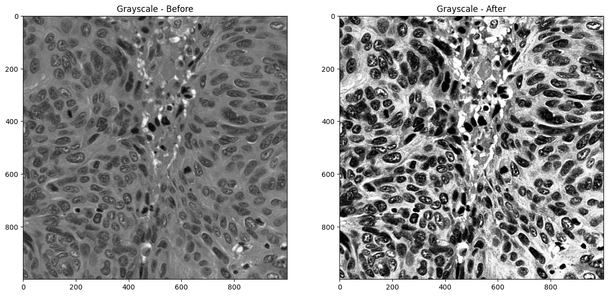
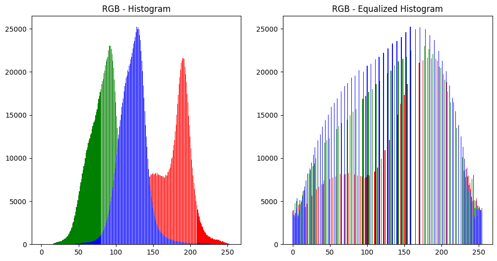
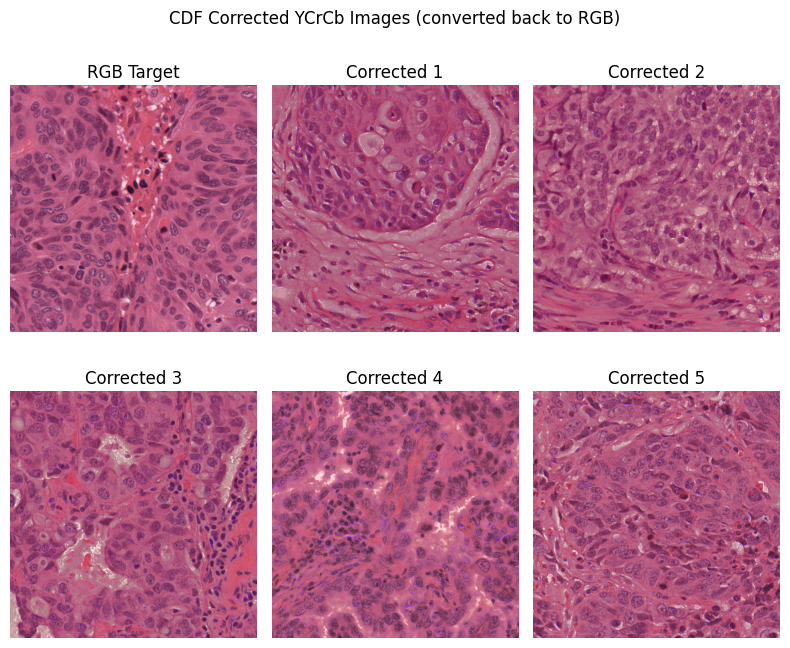

# Assignment 2

Viktor Modroczký\
Computer Vision @ FIIT STU

The `utils.py` file contains functions that are used throughout the experiment notebooks.

## Experiment 1 - Image Correction

The experiment code and visualizations can be found in the `experiment_1.ipynb` notebook.

### Histogram Equalization & Gamma Correction

Ranges of color spaces in OpenCV for 8-bit images:

- Grayscale: [0, 255]
- RGB: [0, 255] for each channel
- YCrCb: [0, 255] for each channel
- HSV: [0, 180] for the H channel and [0, 255] for S and V channels
- XYZ: [0, 255] for each channel
- Lab: [0, 255] for each channel

These ranges need to be taken into consideration when performing histogram equalization. To perform histogram equalization on an image, each channel needs to be equalized separately. To equalize a channel, we use the `equalize_hist` function from the `utils.py` file. To correct the gamma of an image, we use the `gamma_correction` function from the `utils.py` file. Both functions are based on OpenCV tutorials ([for histogram equalization](https://docs.opencv.org/4.9.0/d4/d1b/tutorial_histogram_equalization.html) and [for gamma correction](https://docs.opencv.org/4.9.0/d3/dc1/tutorial_basic_linear_transform.html)). Both are also documented in the `utils.py` file in their respective docstrings.

The `correct_images` function in the `utils.py` file is used to apply both histogram equalization and gamma correction to an array of images, which we use to apply these corrections to images in each color space (except for the grayscale color space, where we only apply histogram equalization and gamma correction to one image).

#### Grayscale

A grayscale image only has a single channel, so both histogram equalization and gamma correction are only applied to one channel. We ran the following code to equalize the histogram of only one grayscale image and then correct its gamma:

```python
img_equalized = equalize_hist(img, 256)
img_eq_gamma_corrected = gamma_correction(img_equalized, 0.6, 255)
```

**Results:**

The following images show the original grayscale image, the equalized grayscale image, and the gamma-corrected equalized grayscale image.



The following histograms show histograms of the original grayscale image, the equalized grayscale image, and the gamma-corrected equalized grayscale image.


#### RGB

An RGB image has three channels, so both histogram equalization and gamma correction are applied to each channel separately. To equalize histograms and correct the gamma of each RGB image, we ran the following code:

```python
rgb_images_eq, rgb_images_eq_gamma = correct_images(rgb_images, 0.6, [255, 255, 255])
```

**Comparison of one of the original RGB images with its equalized and gamma-corrected versions:**


**Comparison of histograms of one of the original RGB images with its equalized and gamma-corrected versions:**



**Every equalized RGB image:**


**Every gamma-corrected equalized RGB image:**


**Every original RGB image:**


#### YCrCb, HSV, XYZ and Lab

The same process as for the RGB color space was applied to the YCrCb, HSV, XYZ, and Lab color spaces. The only difference is that the H channel of the HSV color space has a range of [0, 180], so we used 180 as the maximum value for the equalization and gamma correction of the H channel.

The following code was used to equalize histograms and correct the gamma of each image in the YCrCb, HSV, XYZ, and Lab color spaces:

```python
ycrcb_images_eq, ycrcb_images_eq_gamma = correct_images(ycrcb_images, 0.6, [255, 255, 255])
hsv_images_eq, hsv_images_eq_gamma = correct_images(hsv_images, 0.6, [180, 255, 255])
xyz_images_eq, xyz_images_eq_gamma = correct_images(xyz_images, 0.6, [255, 255, 255])
lab_images_eq, lab_images_eq_gamma = correct_images(lab_images, 0.6, [255, 255, 255])
```

These were then converted back to the RGB color space and then we visualized the results for 3 images from each color space:


### Source to Target Color Correction using eCDF

For the purpose of this task we created the following function in the `utils.py` file: `get_cdf` and `change_images_cdf`. The `get_cdf` function calculates the cumulative distribution function of a channel in an image. The `change_images_cdf` function performs color correction for multiple images (sources) to match the colors of another image (target).

The following code was used to perform color correction for the images:

```python
cdf_corrected_rgb_images = change_images_cdf(rgb_images, [target_cdf_r, target_cdf_g, target_cdf_b])
cdf_corrected_ycrcb_images = change_images_cdf(ycrcb_images, [target_cdf_y, target_cdf_cr, target_cdf_cb])
```

where `target_cdf_r`, `target_cdf_g`, and `target_cdf_b` are the cumulative distribution functions of the R, G, and B channels of the target image, and `target_cdf_y`, `target_cdf_cr`, and `target_cdf_cb` are the cumulative distribution functions of the Y, Cr, and Cb channels of the target image. These were calculated using the `get_cdf` function.

The YCrCb images were then converted back to the RGB color space. The results for every image in the dataset are visualized below:




## Experiment 2 - Image Enhancement

The experiment code and visualizations can be found in the `experiment_2.ipynb` notebook.
